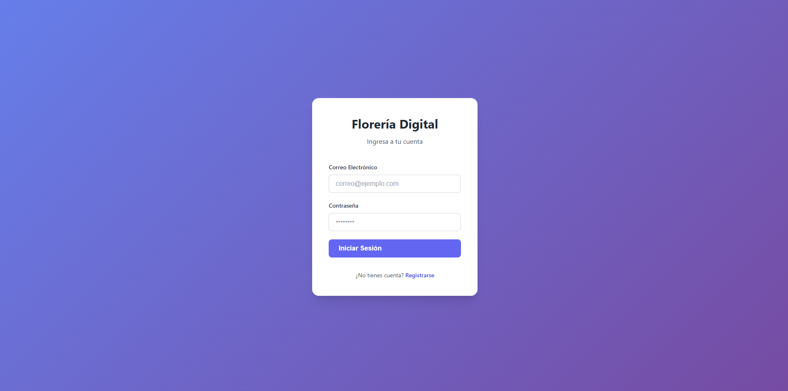
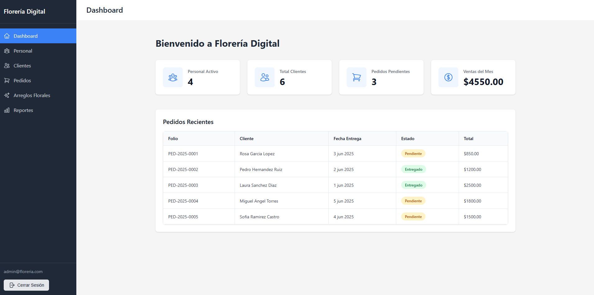
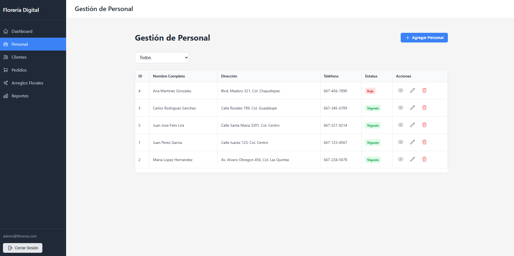
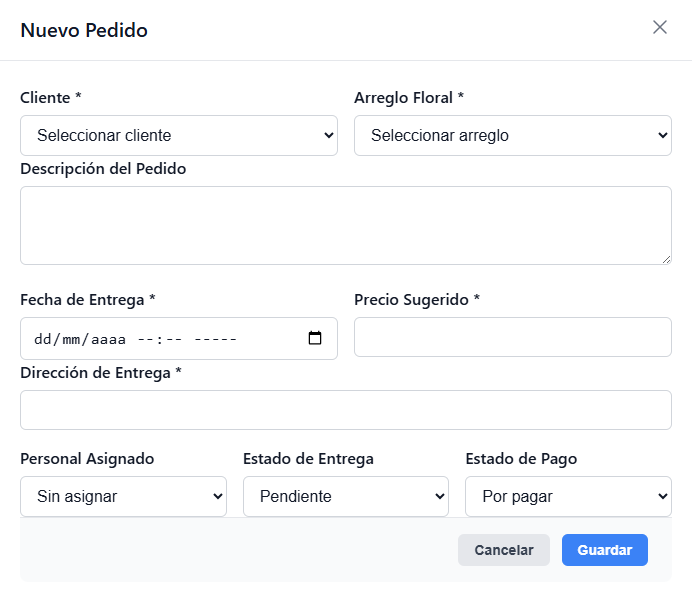
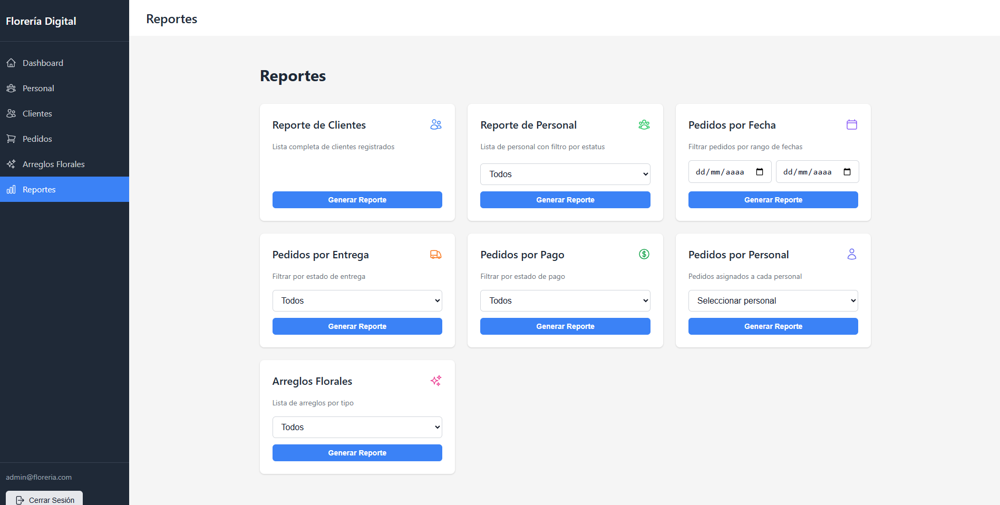

# Florería Digital — Flower Shop Management System

<p align="center">
  
  
  
  
  
  
</p>

> A fullstack web application for managing a flower shop — handling staff, customers, orders, and floral arrangement catalog from a single interface, with Excel-exportable reports and Firebase-based authentication.

---

## Screenshots

### Login


### Dashboard


### Staff Management


### New Order Form


### Reports


---

## Architecture

Two independent modules orchestrated with Docker Compose:

```
floreria-digital/
├── api_tienda/        # Backend — REST API
├── cliente_tienda/    # Frontend — SPA
├── init.sql           # Schema and seed data
└── docker-compose.yml
```

### Backend — `api_tienda`
REST API built with **Node.js + Express + TypeScript**, organized in layers:

```
src/
├── routes/       # Endpoint definitions
├── controllers/  # Request and response handling
├── models/       # Data access layer (MySQL)
├── middlewares/  # Validation, error handling
├── validations/  # Zod schemas
├── config/       # Database, CORS
└── utils/        # Order number generator
```

**Key decisions:**
- **Zod** for validation on both layers — consistent schemas across the stack
- **mysql2** with connection pooling for better performance under concurrent requests
- **express-async-errors** for clean async error handling without try/catch on every route
- **ExcelJS** for server-side report generation with proper formatting

### Frontend — `cliente_tienda`
SPA built with **Vue.js 3 + Vite + TypeScript**:

```
src/
├── views/        # Main pages (Staff, Customers, Orders, etc.)
├── components/   # Reusable components (Layout, Modals)
├── stores/       # Global state with Pinia (authentication)
├── services/     # HTTP client with Axios
├── router/       # Navigation with auth guards
├── config/       # Firebase configuration
└── types/        # Shared TypeScript interfaces
```

**Key decisions:**
- **Pinia** over Vuex — simpler API with better TypeScript support
- **Firebase Authentication** for session management without building auth from scratch
- **Axios interceptors** to automatically attach the Firebase token to every API request
- Navigation guards with **explicit Firebase state waiting** to avoid race conditions on load

---

## Features

### CRUD Modules
| Module | Operations |
|--------|------------|
| Staff | Create, edit, soft-delete, view assigned orders |
| Customers | Create, edit, delete |
| Floral Arrangements | Create, edit, soft-delete, filter by type and status |
| Orders | Register, edit, filter by delivery and payment status |

### Reports with Excel Export
- Customer list
- Staff by status (active / inactive)
- Orders by date range
- Orders by delivery status
- Orders by payment status *(with total sum when filtered by paid)*
- Orders by assigned staff member
- Floral arrangements catalog by type

### Authentication
- Login and registration via **Firebase Authentication**
- Protected routes — redirects to login if no active session
- Firebase token automatically sent with every API request

---

## Tech Stack

| Layer | Technology | Purpose |
|-------|-----------|---------|
| Frontend | Vue.js 3 + Vite | SPA framework with fast build |
| Frontend | TypeScript | Static typing across the app |
| Frontend | Pinia | State management |
| Frontend | Axios | HTTP client with interceptors |
| Frontend | Zod | Form validation |
| Frontend | Firebase Auth | User authentication |
| Backend | Node.js + Express | REST API |
| Backend | TypeScript | Static typing |
| Backend | Zod | Request validation |
| Backend | mysql2 | MySQL connection with pooling |
| Backend | ExcelJS | Excel report generation |
| Database | MySQL 8 | Data persistence |
| Infrastructure | Docker + Compose | Containerization |
| Infrastructure | Nginx | Frontend server in production |
| Deployment | Railway | Cloud hosting |

---

## Data Model

```
personal (staff)          clientes (customers)
────────────────          ────────────────────
id (PK)                   id_cliente (PK)
nombre_completo           nombre_completo
direccion                 direccion
telefono                  telefono
estatus (1=active|2=off)

arreglos_florales              pedidos (orders)
─────────────────              ───────────────
id_arreglo (PK)                folio (PK)
descripcion                    id_cliente (FK)
tipo_arreglo (1-4)             id_arreglo (FK)
estatus (1|2)                  id_personal (FK)
                               descripcion
                               fecha_pedido
                               fecha_entrega
                               direccion_entrega
                               precio_sugerido
                               entregado (1|2)
                               pagado (1|2)
```

---

## Running Locally

### Prerequisites
- Docker Desktop installed

### Start everything

```bash
git clone https://github.com/JuanvlzqzTec/Floreria-digital.git
cd Floreria-digital
docker-compose up -d
```

| Service | URL |
|---------|-----|
| Frontend | http://localhost |
| API | http://localhost:3000 |
| MySQL | localhost:3308 |

### Demo credentials

| Field | Value |
|-------|-------|
| Email | admin@floreria.com |
| Password | Admin1234 |

> You can also register a new account from the login screen.

---

## Author

**Juan Antonio Velázquez Alarcón**  
Computer Systems Engineering — Instituto Tecnológico de Culiacán

<p>
  <a href="https://github.com/JuanvlzqzTec">
    
  </a>
</p>